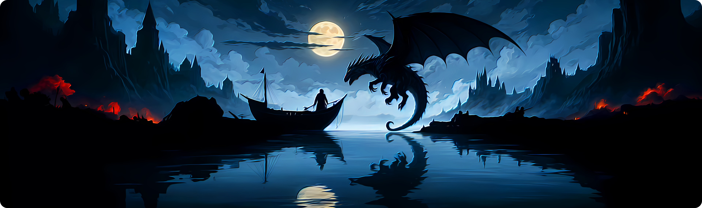
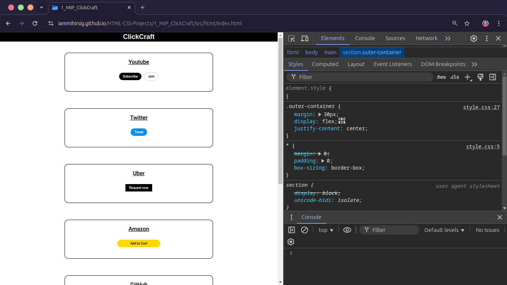

# [ClickCraft](https://iammihirsig.github.io/HTML-CSS-Projects/1_MIP_ClickCraft/)

> 🚨 **[ClickCraft Live Preview](https://iammihirsig.github.io/HTML-CSS-Projects/1_MIP_ClickCraft/src/html/index.html)** 🚨

Welcome to the **[ClickCraft](https://iammihirsig.github.io/HTML-CSS-Projects/1_MIP_ClickCraft/)** project! This project is part of the **[HTML-CSS-Projects](https://github.com/iammihirsig/HTML-CSS-Projects)** repository and focuses on creating buttons inspired by various popular websites. It also includes basic HTML text elements to demonstrate button placement and styling.

## Table of Contents

- [About](#about)
- [Features](#features)
- [Screenshots](#screenshots)
- [Technologies Used](#technologies-used)
- [How to Use](#how-to-use)
- [License](#license)
- [Credits](#credits)

## About

This project demonstrates the creation of stylish and functional buttons inspired by different website designs. Each button replicates the look and feel of popular sites, providing a hands-on way to learn and practice HTML and CSS skills. Alongside the buttons, basic text elements are included to showcase placement and layout options.

## Features

- Buttons styled to resemble those on well-known websites
- Custom hover effects, transitions and shadows
- Easy-to-read and modular CSS for customization
- Fully Responsive

## Screenshots

> 

## Technologies Used

- **HTML5**: For structuring the content
- **CSS3**: For styling the buttons and layout

## How to Use

1. Clone this project to your local machine:

   ```bash
   git clone https://github.com/iammihirsig/HTML-CSS-Projects.git
   ```

2. Navigate to the project folder:

   ```bash
   cd 1_MIP_ClickCraft
   ```

3. Open the `index.html` file in your web browser:

   ```bash
   open index.html
   ```

4. Experiment with the code! Feel free to add your own styles or create new buttons.

## License

This project is part of the **HTML-CSS-Projects** repository, which is licensed under the [MIT License](../LICENSE). You are free to use, modify, and share the code as long as proper credit is given.

## Credits

- Special thanks to [SuperSimpleDev](https://www.youtube.com/@SuperSimpleDev) for their amazing resources. If you're looking to learn HTML and CSS, check out this gem of a video: [Learn HTML & CSS](https://youtu.be/G3e-cpL7ofc?feature=shared).

---

Crafted with 💙 by Mihir Raj Singh | GitHub: [iammihirsig](https://github.com/iammihirsig)
