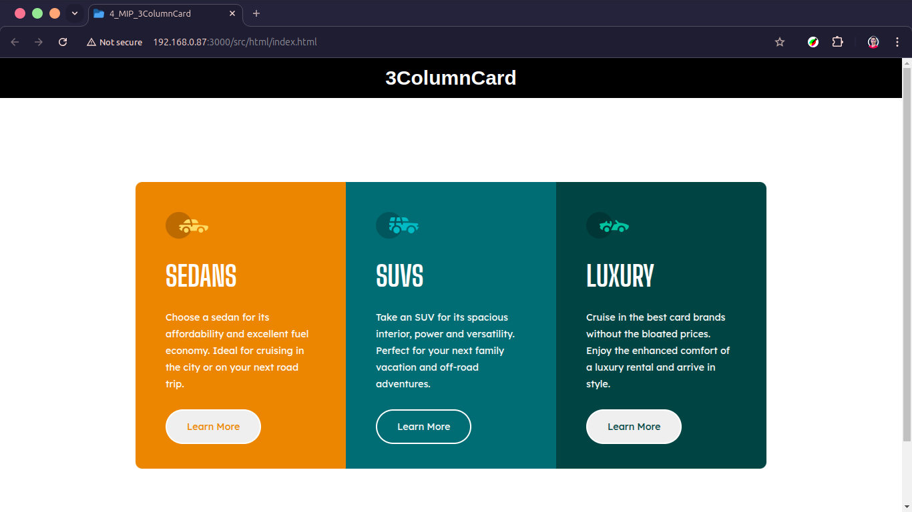

# [3ColumnCard](https://iammihirsig.github.io/HTML-CSS-Projects/4_MIP_3ColumnCard/)

> 🚨 **[3ColumnCard Live Preview](https://iammihirsig.github.io/HTML-CSS-Projects/4_MIP_3ColumnCard/src/html/index.html)** 🚨

Welcome to the **[3ColumnCard](https://iammihirsig.github.io/HTML-CSS-Projects/4_MIP_3ColumnCard/)** project! This project is part of the **[HTML-CSS-Projects](https://github.com/iammihirsig/HTML-CSS-Projects)** repository and showcases the creation of a 3ColumnCard using fundamental HTML and simple CSS styling. The primary objective of this project is to learn about mobile first development and optimization of the CSS code.

## Table of Contents

- [About](#about)
- [Features](#features)
- [Screenshots](#screenshots)
- [Technologies Used](#technologies-used)
- [How to Use](#how-to-use)
- [License](#license)
- [Credits](#credits)

## About

This project showcases the creation of a sleek and modern 3ColumnCard using fundamental HTML and CSS. The design is fully responsive and centered, offering a practical way to learn and apply CSS centering techniques. This project emphasizes mastering layout and styling basics while creating a visually appealing component following mobile first approach.

## Features

- Clean and minimal 3ColumnCard design
- Mobile first design approach
- Fully responsive for seamless viewing across devices
- Modular and easy-to-understand CSS for customization

## Screenshots

> 

## Technologies Used

- **HTML5**: For structuring the content
- **CSS3**: For styling and layout

## How to Use

1. Clone this project to your local machine:

   ```bash
   git clone https://github.com/iammihirsig/HTML-CSS-Projects.git
   ```

2. Navigate to the project folder:

   ```bash
   cd 4_MIP_3ColumnCard
   ```

3. Find & open the `index.html` file in your web browser usually located in `root/src/html`:

   ```bash
   open index.html
   ```

4. Experiment with the code! Feel free to add your own styles or create new buttons.

## License

This project is part of the **HTML-CSS-Projects** repository, which is licensed under the [MIT License](../LICENSE). You are free to use, modify, and share the code as long as proper credit is given.

## Credits

- Special thanks to [Frontend Mentor](https://www.frontendmentor.io/challenges/3column-preview-card-component-pH92eAR2-) for their amazing resources. If you're looking to learn HTML and CSS, check out this gem of a video: [Learn HTML & CSS](https://youtu.be/G3e-cpL7ofc?feature=shared).

---

Crafted with 💙 by Mihir Raj Singh | GitHub: [iammihirsig](https://github.com/iammihirsig)
